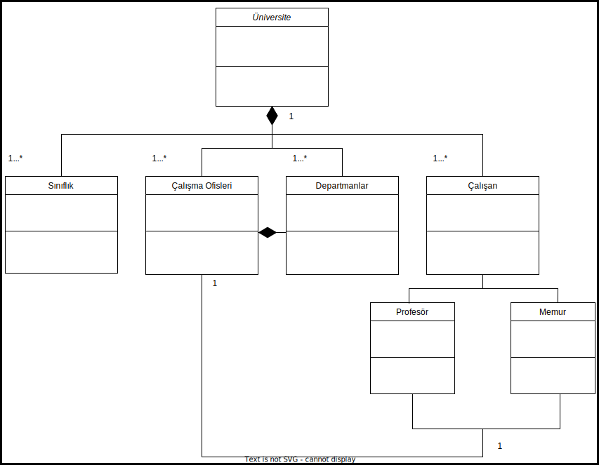

# Üniversite Yönetim Sistemi

## Açıklama
1. Üniversiteye ait sınıflıklar, çalışma ofisleri ve departmanlar vardır.

2. Departmanlara ait ofisler vardır.

3. Üniversiteye ait çalışanlar vardır. Bu çalışanlar profesör veya memur olabilir.

4. Her çalışan bir ofiste çalışır.

Bu sistemi tasvir eden Class (Sınıf) diyagramını çiziniz.

**Not : Sınıflara ait nitelik ve davranışların belirtilmesine gerek yoktur.**

## Ödev

Üniversite yönetim sistemine ait UML Modellemesi ve sınıf diyagramı.

Patika profilim: [oemerfaruk](https://app.patika.dev/oemerfaruk)

